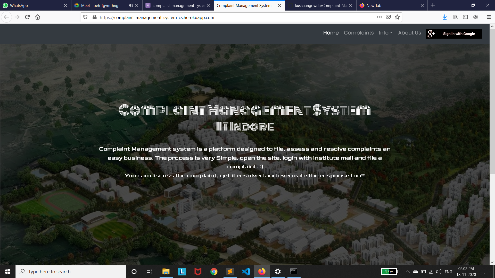
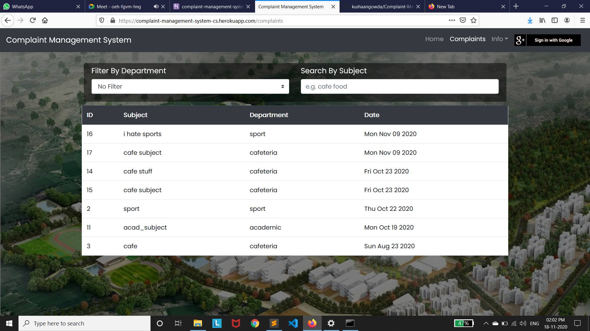
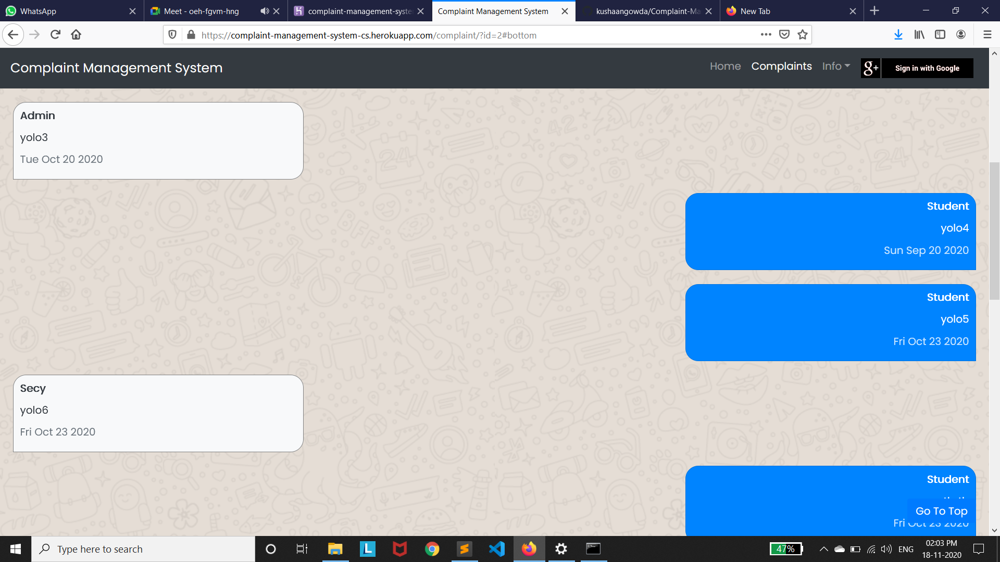
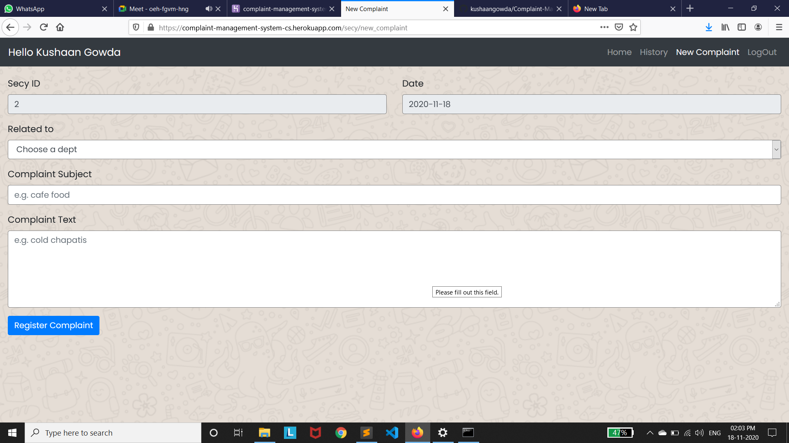

# Complaint Management System
CS 207 Aug 2020 project   
Complaint Management system is a platform designed to manage complaints in a better way. The process is very Simple, open the site, login with institute mail ID and file a complaint. :)
You can discuss the complaint, get it resolved and even rate the response too!!  
  
## Tech Stuff Used
HTML5, CSS3, JS, Bootstrap    
NodeJs    
MySQL  
  
## Run This Webapp On Your Local Device
Install NodeJS   
For database, install XAMPP(Windows) or MAMP(MacOS)  
Clone the repository  
  
Create dev.js in config folder    
Add API keys in config > dev.js    
     
   
dev.js file   
   
In CMD, navigate to Complaint-Management-System folder and run   
`$ npm install`   
    
Open XAMPP or MAMP and start SQL and Apache servers  
In your browser, navigate to this [URL](http://localhost/phpmyadmin/)
Click on 'NEW' Button to create a new database  
Name it complaint_management  
In this database, import complaint_management.sql from stuff folder  

Then in CMD, run this code  
`$ node server.js` 
   
In your browser, navigate to this [URL](http://localhost:3000)  
Index Page would be visible  
Now you can add your emailID in either of secy_list, admin_list or student_list, and use the webApp :)   
   
## Website Screeenshots    
   
      
  
    

## Contributors  
[Kushaan Gowda](https://github.com/kushaangowda/)   
[Abhinav Reddy](https://github.com/pixelbullet)  
[Keelisetti Lokesh](https://github.com/lokeshkeelisetti)  
[Bhagavan](https://github.com/satyabhagavan)  
[Rohit Banga](https://github.com/RohitBanga3)    
   
#### If you find any errors, feel free to raise an issue :)  
  
  
