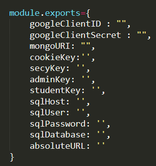

# Complaint Management System
CS 207 Aug 2020 project   
Complaint Management system is a platform designed to manage complaints in a better way. The process is very Simple, open the site, login with institute mail and file a complaint. :)
You can discuss the complaint, get it resolved and even rate the response too!!

## Tech Stuff Used
HTML5, CSS3, JS, Bootstrap   
NodeJs   
MySQL

## Clone This Repo
Create dev.js in config folder    
Add API keys in config > dev.js   

In CMD, mnavigate to this particular folder and run   
`$ npm install`   
`$ node server.js`   

[Heroku Link](https://complaint-management-system-cs.herokuapp.com/)  
